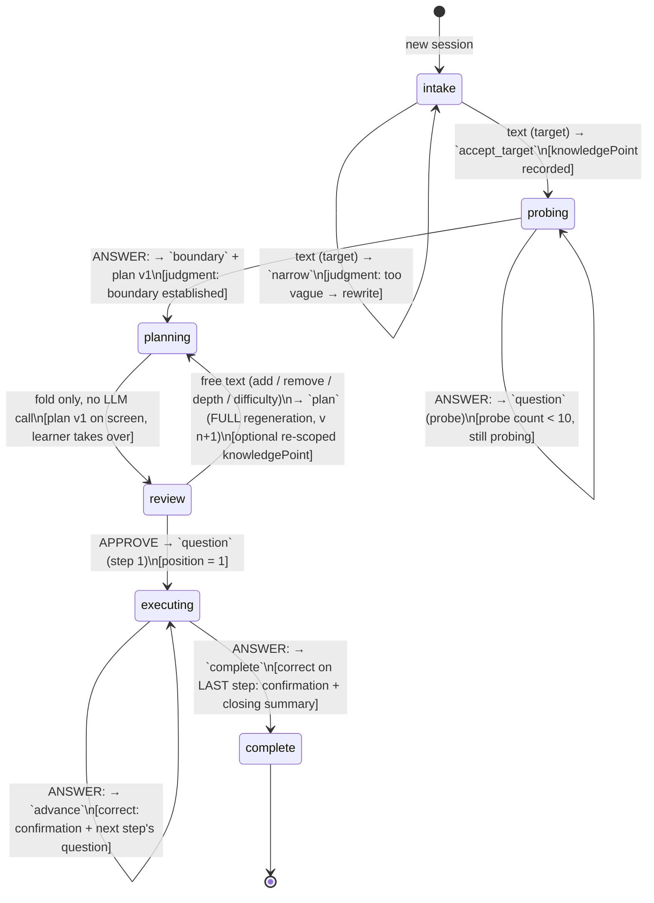

# Architecture — Learn Anything

Status: design phase. Depth is components, process boundaries, and data flow — the schema lives in [Schema](schema.md); API routes remain an implementation-time decision.

Terminology per [`CONTEXT.md`](../CONTEXT.md).

## Principles

1. **The LLM-turn log is the source of truth.** Session state is the append-only log of LLM turns — one row per learner action — and everything else (stage, plan + revision, position, the progress markdown, the live view) is folded or rendered from it (ADR 0001, ADR 0004).
2. **Quizzes are generated at execution time**, not plan time (ADR 0002).
3. **The stage machine is deterministic.** The LLM generates content inside fixed contracts; it does not drive the flow (ADR 0003).
4. **One LLM call per learner turn, and never a system call.** No call exists without learner input — so a turn that crosses a stage boundary bundles its outputs (boundary + plan v1; final confirm + closing summary).

## Components

One Next.js (TypeScript) monolith. One container. One Postgres. No workers, queues, caches, or websockets — every learner action is a single HTTP turn.

| Component | Responsibility | Purity |
|---|---|---|
| `app/` (Next.js routes) | Home, per-session view, the turn action(s). Thin: parse the action, wire the layers, render. | — |
| `core/session` | The stage machine: the reducer (log → stage, plan + revision, position, progress), transitions, invariants. | Pure — no I/O |
| `core/contracts` | Per-stage Zod schemas — the LLM's contracts: intake verdict, probing question, plan, step question, explanation, re-test, closing summary. The same schemas validate the log's `response` payloads. | Pure |
| `core/llm` | Thin Vercel AI SDK client, configured by env; the swap point for a fake LLM in tests. | I/O seam |
| `core/store` | Postgres access: the seeded Learner (incl. current-Learner resolution), the sessions row, the LLM-turn log, and the `raw_messages` UI projection. Every row reachable via `sessions.user_id`. | I/O seam |
| `core/markdown` | Fold state → progress markdown. | Pure — runs in the FE (and SSR for first paint); the BE never emits the markdown. Output never read back. |

## Stages and invariants

A session moves **intake → probing → planning → review → executing → complete**. Transitions are code. The LLM signals judgments ("is the target specific enough?", "is the boundary established?") as declared fields of its structured output; the code acts on them.



Edge labels are `request → response.type` (payload shapes pinned in `core/contracts`). `planning` and `complete` never occur as row types: plan v1 arrives inside the `probing` row, so the fold goes probing → review in one row — `planning` is the label for "a plan exists, unapproved", never the stage when a request is made; and nothing is input after `complete`.

**What changes, per transition** — the folded state is stage, knowledge point, plan + revision, position, active question, steps passed:

| In stage | Learner sends | `response.type` | State change |
|---|---|---|---|
| intake | intake text | `narrow` | none — rewrite requested (unbounded rounds) |
| intake | intake text | `accept_target` | `knowledgePoint` set → probing |
| probing | `ANSWER:<n>` | `question` | active question replaced (probe *k*) |
| probing | `ANSWER:<n>` | `boundary` | **plan v1** appears, revision = 1 → planning/review |
| review | free text | `plan` | plan **replaced** (revision = ordinal of plan responses), optional `knowledgePoint` re-scope → planning/review |
| review | `APPROVE` | `question` | position = step 1, active question = step 1's → executing |
| executing | `ANSWER:<n>` | `retest` | explanation recorded, active question = new question **on the same step** |
| executing | `ANSWER:<n>` | `advance` | step marked passed, position + 1, active question = next step's |
| executing | `ANSWER:<n>` | `complete` | last step passed, closing summary appended → complete (terminal) |

Invariants enforced in `core/session`, never trusted to the model:

- Exactly one active question at a time
- A re-test question differs from the just-failed question
- Probing ends when the AI judges the boundary established, hard cap 10 questions
- Plans are concepts only, ≤ 20 steps unless the learner explicitly overrides
- Execution cannot start before explicit approval
- A session is complete only when every learning step has passed

## The turn

One learner action, end to end:

1. The route handler receives the action — free text (intake or plan adjustment), an MC/TF answer, or an approval.
2. `core/session` folds the log to the current stage and validates the action against it.
3. The prompt is **reconstructed**: the system contract for the stage + the serialized transcript of all prior log rows + the learner's new input. The call is one structured generation against the stage's Zod contract.
4. The `(request, response)` pair is appended to the log via `core/store`, and the `raw_messages` projection is updated in the same turn. There are no pointers to advance — the next fold over the log *is* the new state.
5. The turn response carries the folded state summary; the view and the progress markdown re-render from it in the FE (first paint is server-rendered from the same fold).

Because calls never happen without learner input, a turn that crosses a stage boundary bundles its outputs into the single response: boundary + plan v1, explanation + re-test question, final confirm + closing summary.

## Persistence rules

- **The log is the only truth.** `session_messages` is append-only: one row per LLM turn (learner input + structured reply). A resumed session never changes what already happened — resume is a fold, and "Plan v3" is simply the ordinal of plan responses.
- **Everything else is a projection.** Stage, plan + revision, position, and progress are folded by the reducer; the progress markdown renders from the fold (ADR 0001); `raw_messages` caches the SDK's `UIMessage[]` for chat rehydration — an interim, rebuildable, droppable projection (ADR 0004).
- The one mutable column: `sessions.knowledge_point` — the short home label, updated on re-scope; the canonical copy lives in the log.
- Every row is reachable via `sessions.user_id`, so per-account privacy is structural — even though the MVP runs one static learner.

## Identity (MVP)

- One static learner, seeded by [`db/seed.sql`](../db/seed.sql).
- Current-Learner resolution lives in the db layer (`core/store`): in the MVP it returns the seeded row for every request; post-MVP it becomes a session-cookie → real-learner lookup. No separate identity module.
- Real auth (email + password, reset) is post-MVP.

## LLM access

- Vercel AI SDK; one OpenAI-compatible client configured by env — **hot-swappable by configuration, not code**:

  ```
  LLM_BASE_URL   http://localhost:11434/v1 (local Ollama) | https://api.deepseek.com/v1 (online)
  LLM_API_KEY    anything for Ollama; the real key online
  LLM_MODEL      a local llama model id | a DeepSeek model id
  ```

- All model output is a structured object validated against a `core/contracts` Zod schema.
- `core/llm` sits behind a small interface so the full loop is testable with a fake LLM: no API keys, deterministic.
- The local model must support structured output. Local is the flow-testing box; DeepSeek is the quality bar.

## Frontend

One Next.js (TypeScript) frontend in the same monolith: chat sidebar + read-only progress-markdown pane, per the design in [`design/code.html`](../design/code.html). The document pane is state-shaped: it renders from the server-folded state summary in the turn response — never from `raw_messages`.

- **CSS:** Tailwind v4; the design's token palette is ported into the theme; `@tailwindcss/typography` for the document pane, with the `react-markdown` `components` mapping owning the domain blocks (plan checklist, per-question outcomes).
- **Components:** shadcn/ui (Radix-based, in-repo). No runtime component frameworks.
- **Icons / fonts:** lucide-react; Geist + JetBrains Mono via `next/font/google`.
- **Markdown:** `react-markdown` + `remark-gfm` + shiki for code blocks. The `state → markdown` render is the shared pure `core/markdown` module running in the FE (SSR for first paint); the BE never emits a markdown string. Download is a client-side Blob of that same in-memory string — no BE route.
- **Chat / turns:** `ai` package client (`useChat`), streaming; the turn response carries the folded state summary that drives the document pane; chat rehydrates from the `raw_messages` `UIMessage[]` projection (ADR 0004).
- **The document pane is not an editor.** The progress markdown is a read-only projection (ADR 0001); learner adjustments flow through chat turns. No editor library (CodeMirror/Monaco) is in the stack.
- **Deliberately absent:** state-management, form, animation, and data-fetching libraries.

## Deployment

- One Docker container (the Next.js app) + one Postgres instance.
- The concrete host (VPS / PaaS) is decided at deploy time; nothing in this design depends on the choice.

## Testing seams

- `core/session` and `core/markdown` are pure → unit-tested without I/O.
- The `core/llm` interface takes a fake → an integration test can walk a whole session, probing → planning → review → executing → complete, fully offline.

## Deferred (explicitly out of scope for this design)

- Real schema migrations (the dev/test dbs sync straight from [`db/schema.ts`](../db/schema.ts) via `drizzle-kit push`, ADR 0005), extra API routes
- Real auth, password reset, email
- AI failure modes (timeouts, provider errors, malformed output) — deferred per user stories; the seam for them is contract validation + a bounded retry at the call site
- Deleting/abandoning sessions, concurrent writes to one session, duplicate knowledge points
